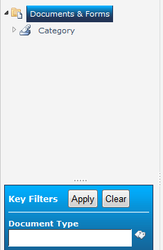
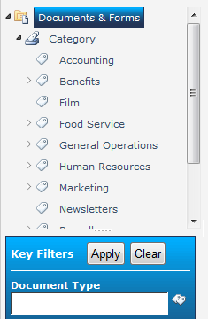

# MetadataNavExpansion

Use this solution to change the default expansion of the MetaData Navigation Tree in SharePoint 2010, 2013, or 2016. Here's a longer introduction on my [blog](https://thechriskent.com/2012/05/09/changing-the-default-expansion-of-metadata-navigation-on-initial-page-load/]).

## What it Does:
This solution does 2 things:
- Creates a Backup of the `MetaDataNavTree.ascx` file in the Hive
- Changes the default expansion from 0 to 2

### Here's what it looks like on initial page load
| Standard: | With MetaDataNavExpansion: |
----- | -----
|||
| _"Der... What do I do?"_ | _"WOWEE! This site is amazing!"_ |

## Benefits:
This eliminates a click for end users trying to find the navigation. Doing this makes the first visit to the site much easier since the navigation is not hidden by default. This also keeps frustration down for non technical users who can't remember where the navigation items are from visit to visit.

All of this can be done manually as pointed out by [Entan Ming on technet](http://social.technet.microsoft.com/Forums/sk-SK/sharepoint2010customization/thread/0b12f4d4-e899-4bd3-8aed-02d85e8ecf8d). However, in the event of recovery or the addition of new servers to your farm these changes will have to be repeated manually. This is both irritating and error-prone. By deploying these changes through a solution you can be sure that:
- The changes will be reapplied in the event of Disaster Recovery
- The changes will be applied to new servers as they are added to your farm
- You don't have to personally edit every 14 Hive for each server in your farm

## How it Works:
On activation a one-time timer job runs. This job creates a backup copy of the current `MetaDataNavTree.ascx`. It then changes the `ExpandDepth` property of the `MetaDataNavTree.ascx` file from 0 to 2.

Then anywhere the MetaData Navigation is used in the farm, it will automatically expand as desired! WHOO WHOO!

On deactivation, the same timer job runs again but this restores the backup created of the `MetaDataNavTree.ascx` file.

> _Note: This is a farm wide change and will applied to all current and future instances of MetaData Navigation. If you are using the navigation with a taxonomy with several (2000+)  top level items, this will affect performance of the site's initial load. This is why this is off by default. Does that mean you can't use this? Nope. You were going to suffer that performance hit when the user expanded it anyway. So the solution is to never use MetaData Navigation with a taxonomy like that. It's not very helpful or user friendly to have that many top level items and should either be broken into subnodes or it isn't a great candidate for navigation - regardless of using this solution._

> MIGRATED FROM CODEPLEX - This is an older, Farm based solution. It can still be used (especially with SharePoint 2010 & 2013) but only applies to On-Premises SharePoint (hence, the farm solution).
